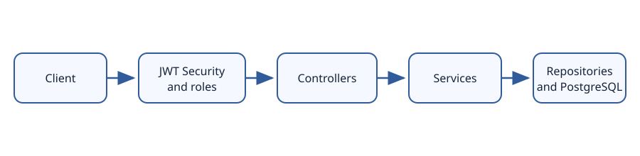
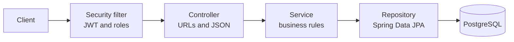

# Shop Backend

REST API and real-time backend for an online shop, built with **Spring Boot**, **Spring Security (JWT)**, **Spring Data JPA**, and **PostgreSQL**. Customers can browse products, manage a cart and wishlist, place orders, chat with support, and receive live notifications. Admins and support agents manage the shop.

The matching React frontend is in a separate repository: [shop-frontend](https://github.com/YOUR_USERNAME/shop-frontend) *(replace this URL with the frontend repository link).* 



## Contents

- [Features](#features)
- [Tech stack](#tech-stack)
- [How it works](#how-it-works)
- [Database design](#database-design)
- [Project structure](#project-structure)
- [Getting started](#getting-started)
- [Configuration](#configuration)
- [API overview](#api-overview)
- [Testing](#testing)
- [Troubleshooting](#troubleshooting)
- [Project status](#project-status)

## Features

| Area | What it does |
|---|---|
| Categories | Parent and child categories, such as Phones and Tablets > Smartphones |
| Products | Name search, category and price filters, sorting, pagination, suggestions, soft delete |
| Accounts and roles | Registration, login, logout with JWT revocation; `CUSTOMER`, `SUPPORT`, and `ADMIN` roles |
| Google sign-in | Verify a Google ID token and issue the shop's JWT |
| Cart | Add, change, and remove items; server-calculated subtotal, shipping, and total |
| Wishlist and recently viewed | Saved favourites and recently opened products |
| Orders | Checkout, price snapshots, stock updates, cancellation and admin status updates |
| Notifications | Persisted in PostgreSQL and pushed over WebSocket |
| Live chat and inbox | STOMP chat, chat history, support inbox and unread summary |
| Help and support | FAQs, contact details, support tickets, and agent replies |
| Account management | Profile, password, deactivation, privacy policy, and terms |
| WhatsApp | Support, order-help, and product-sharing links |
| Tests | Unit tests and MockMvc integration tests using H2 |

## Tech stack

| Layer | Technology |
|---|---|
| Language | Java 21 |
| Framework | Spring Boot 4.1, Spring MVC |
| Security | Spring Security, JJWT, BCrypt |
| Data | Spring Data JPA, Hibernate, PostgreSQL |
| Real time | Spring WebSocket with STOMP |
| Build | Maven Wrapper |
| Helpers | Lombok, Jakarta Bean Validation |
| Tests | JUnit 5, Mockito, MockMvc, H2 |

## How it works

Requests pass through the JWT/role security filter, a controller, a transactional service, and a Spring Data repository before reaching PostgreSQL.



Checkout runs in one database transaction: the service checks stock, reduces inventory, saves the order and price snapshots, empties the cart, and saves a notification. A failure rolls back the database changes.

For chat, clients connect to `/ws` with a JWT in the STOMP `Authorization` CONNECT header, send to `/app/chat.send`, and receive private messages at `/user/queue/chat`. Support agents can subscribe to `/topic/support`.

## Database design

Main tables include `users`, `categories`, `product`, `carts`, `cart_items`, `shop_orders`, `order_items`, `wishlist_items`, `recently_viewed`, `notifications`, `support_tickets`, `chat_messages`, and `revoked_tokens`.

- Order items retain the product name and unit price at purchase time.
- Products are hidden with `active=false`; accounts are disabled with `enabled=false`. This preserves references from order history.
- Categories are hierarchical through their nullable `parent_id`.

## Project structure

```text
src/main/java/com/example/shop/
  config/       WebSocket, OpenAPI and data seeders
  security/     JWT, HTTP security and WebSocket authentication
  controller/   REST and WebSocket controllers
  service/      Feature logic and transactions
  repository/   Spring Data JPA repositories and product filters
  model/        JPA entities and enums
  dto/          Request and response records
  exception/    API errors and exception handling
src/main/resources/application.properties
src/test/       Unit and integration tests
docs/           Architecture diagram
```

## Getting started

### Prerequisites

- JDK 21
- PostgreSQL 14 or newer
- Git

### 1. Clone the repository

```bash
git clone https://github.com/YOUR_USERNAME/shop-backend.git
cd shop-backend
```

Replace `YOUR_USERNAME` with the GitHub account that hosts this repository.

### 2. Create the database

```bash
sudo -u postgres psql -c "CREATE DATABASE shopdb;"
```

Or create `shopdb` in pgAdmin under **Databases > Create > Database**.

### 3. Configure local environment variables

The application has development defaults, but set your database password and a unique JWT secret before running:

```bash
export DB_PASSWORD='your-postgres-password'
export JWT_SECRET="$(openssl rand -base64 48)"
```

In IntelliJ, set these in **Run > Edit Configurations > Environment variables**. If Google sign-in is enabled, also set `GOOGLE_CLIENT_ID`. The admin seed account can be configured with `ADMIN_EMAIL` and `ADMIN_PASSWORD`.

### 4. Run the application

```bash
./mvnw spring-boot:run       # Linux/macOS
mvnw.cmd spring-boot:run     # Windows
```

The API starts at `http://localhost:8080`. When `shop.seed.enabled=true`, an empty database is populated with a development admin, categories, sample products, and FAQs.

Check the public category endpoint:

```bash
curl -i http://localhost:8080/api/categories
```

Development admin defaults (change these before use outside local development):

| Email | Password |
|---|---|
| `admin@shop.com` | `Admin@12345` |

## Configuration

Settings are in `src/main/resources/application.properties`. Environment-variable defaults use Spring's `${VARIABLE:default}` syntax.

| Property | Environment variable | Purpose |
|---|---|---|
| `spring.datasource.url` | — | PostgreSQL URL; default `jdbc:postgresql://localhost:5432/shopdb` |
| `spring.datasource.username` | — | PostgreSQL username; default `postgres` |
| `spring.datasource.password` | `DB_PASSWORD` | PostgreSQL password; local default is `1417` |
| `app.jwt.secret` | `JWT_SECRET` | JWT signing secret; development fallback only |
| `app.jwt.expiration-ms` | — | Token lifetime; default 24 hours |
| `app.admin.email` | `ADMIN_EMAIL` | Seed admin email |
| `app.admin.password` | `ADMIN_PASSWORD` | Seed admin password |
| `app.google.client-id` | `GOOGLE_CLIENT_ID` | Google OAuth client ID |
| `app.cors.allowed-origins` | — | Allowed frontend origins; default ports 5173 and 3000 |
| `shop.shipping-fee`, `shop.free-shipping-threshold` | — | Shipping fee and free-shipping threshold |
| `shop.whatsapp-number` | — | Shop number in international digits-only format |
| `shop.support-email`, `shop.support-phone`, `shop.support-hours` | — | Public support contact information |
| `shop.seed.enabled` | — | Whether development seed data is inserted |

Set `spring.jpa.hibernate.ddl-auto=validate` and use database migrations before production deployment. Do not use the development defaults for production secrets.

## API overview

Access: **Public** requires no token; **User** requires a valid login; **Agent** requires `SUPPORT` or `ADMIN`; **Admin** requires `ADMIN`. Send authenticated requests with `Authorization: Bearer <token>`.

| Area | Endpoints | Access |
|---|---|---|
| Auth | `POST /api/auth/register`, `/api/auth/login`, `/api/auth/google` | Public |
| Auth | `POST /api/auth/logout` | User |
| Categories | `GET /api/categories` | Public |
| Category management | `POST /api/categories`, `PUT /api/categories/{id}`, `DELETE /api/categories/{id}` | Admin |
| Products | `GET /api/products` (query: `q`, `categoryId`, `minPrice`, `maxPrice`, `sort`, `page`, `size`), `GET /api/products/{id}`, `GET /api/products/suggestions?q=` | Public |
| Product management | `POST /api/products`, `PUT /api/products/{id}`, `DELETE /api/products/{id}` | Admin |
| Cart | `GET /api/cart`, `POST /api/cart/items`, `PUT /api/cart/items/{productId}`, `DELETE /api/cart/items/{productId}`, `DELETE /api/cart` | User |
| Wishlist | `GET /api/wishlist`, `POST /api/wishlist/{productId}`, `DELETE /api/wishlist/{productId}`, `POST /api/wishlist/{productId}/move-to-cart` | User |
| Recently viewed | `GET /api/recently-viewed`, `DELETE /api/recently-viewed` | User |
| Orders | `POST /api/orders`, `GET /api/orders?q=&page=&size=`, `GET /api/orders/{id}`, `POST /api/orders/{id}/cancel`, `GET /api/orders/{id}/whatsapp-link` | User |
| Order administration | `GET /api/admin/orders?status=`, `PATCH /api/admin/orders/{id}/status`, `GET /api/admin/orders/{id}/customer-whatsapp` | Admin |
| Notifications | `GET /api/notifications?page=&size=`, `GET /api/notifications/unread-count`, `PATCH /api/notifications/{id}/read`, `PATCH /api/notifications/read-all`, `DELETE /api/notifications/{id}` | User |
| Account | `GET /api/account/me`, `PUT /api/account/me`, `POST /api/account/change-password`, `POST /api/account/deactivate` | User |
| Legal | `GET /api/legal/privacy-policy`, `GET /api/legal/terms` | Public |
| Help | `GET /api/support/faqs`, `GET /api/support/contact` | Public |
| Support tickets | `POST /api/support/tickets`, `GET /api/support/tickets`, `GET /api/support/tickets/{id}` | User |
| Ticket administration | `GET /api/admin/support/tickets?status=&page=&size=`, `PATCH /api/admin/support/tickets/{id}` | Agent |
| Chat and inbox | `GET /api/chat/history`, `GET /api/inbox/summary` | User |
| Agent chat | `GET /api/admin/chat/conversations`, `GET /api/admin/chat/{customerId}` | Agent |
| WhatsApp | `GET /api/whatsapp/support-link`, `GET /api/whatsapp/share-product/{id}` | Public |

Order status values are `PENDING`, `CONFIRMED`, `SHIPPED`, `DELIVERED`, and **`CANCELED`**. The API uses the single-L spelling.

### WebSocket chat

Connect to `ws://localhost:8080/ws`. Include `Authorization: Bearer <token>` in the STOMP CONNECT headers.

| Direction | Destination | Purpose |
|---|---|---|
| Client sends | `/app/chat.send` | JSON such as `{"customerId":null,"content":"Hello"}`; support agents include a `customerId` when replying |
| Client listens | `/user/queue/chat` | Private chat messages |
| Client listens | `/user/queue/notifications` | Live notifications |
| Agents listen | `/topic/support` | Shared support feed; customers are denied subscription |

### API documentation

With the application running, open [Swagger UI](http://localhost:8080/swagger-ui/index.html). Use **Authorize** to provide a JWT for protected endpoints. Swagger describes REST endpoints; STOMP destinations are listed above.

### Error responses

Application and validation errors use a JSON response with `status`, `error`, `message`, `timestamp`, and optional `fieldErrors`. Authentication failures may return an empty `401` response.

## Testing

```bash
./mvnw test       # Linux/macOS
mvnw.cmd test     # Windows
```

Tests activate the `test` profile and use an in-memory H2 database, not PostgreSQL. They cover shipping calculations, missing-product service behavior, authentication/authorization, stock limits, and a register-to-checkout flow.

## Troubleshooting

| Problem | Check |
|---|---|
| `password authentication failed` | Confirm `DB_PASSWORD` and PostgreSQL username |
| `WeakKeyException` | Set `JWT_SECRET` to at least 32 bytes |
| `401` response | Log in and send a valid, unexpired, non-revoked Bearer token |
| `403` response | Confirm the account role permits that endpoint |
| Browser CORS error | Add the frontend origin to `app.cors.allowed-origins` and restart |
| Port 8080 already in use | Stop the other process or change `server.port` |
| Red Lombok getters in the IDE | Enable annotation processing and install the Lombok plugin |
| `mvnw: Permission denied` | Run `chmod +x mvnw` once on Linux/macOS |

## Project status

- [x] Categories, products, search, and filters
- [x] JWT authentication, roles, and Google sign-in
- [x] Cart, wishlist, and recently viewed
- [x] Orders and stock handling
- [x] Notifications, live chat, and inbox
- [x] Support, FAQs, account management, and legal pages
- [x] WhatsApp links
- [x] Automated tests and Swagger UI
- [ ] React frontend (`shop-frontend`)
- [ ] Payments (M-Pesa Daraja)
- [ ] Image uploads
- [ ] Email receipts
- [ ] Deployment

## License

No license has been added yet. Add a `LICENSE` file before redistributing this project.
